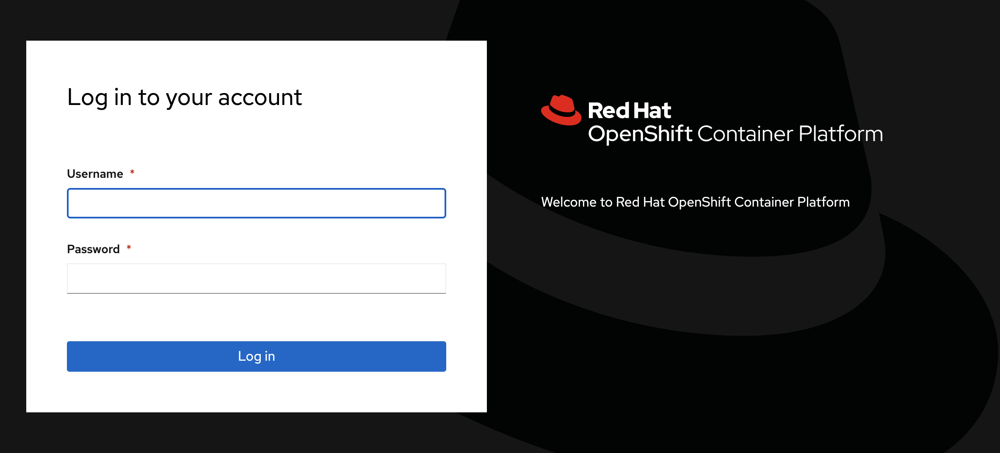

# Login to OpenShift Cluster Environment

The following information are needed:

- OpenShift Console URL: `https://console-openshift-console.apps.vbudi-001.cp.fyre.ibm.com`
- OpenShift API URL: `https://api.vbudi-001.cp.fyre.ibm.com:6443`
- OpenShift user: `studentNN`
- OpenShift password: `passNN`

Perform the following actions:

1. Open a Web Browser to the OpenShift console URL. Accept the certificate errors for both `console-openshift-console` and `oauth-openshift` URLs. You will arrive in the OpenShift login screen:   

2. Enter the user and password for OpenShift, the user should be in the format of `studentNN` and the password is `passNN` where NN is your 2 digits qualifier (01-35).

3. From the console, you are in the Developer view. click **Skip tour**.  

4. Verify all the other required CLIs from your system:

    - oc: see [https://docs.openshift.com/container-platform/4.7/cli_reference/openshift_cli/getting-started-cli.html](https://docs.openshift.com/container-platform/4.7/cli_reference/openshift_cli/getting-started-cli.html)
    - velero: see [https://github.com/vmware-tanzu/velero/releases](https://github.com/vmware-tanzu/velero/releases)

5. From your login drop down on the top right corner select **Copy Login Command**.  

6. In the new tab, click `Display Token` and copy the `oc login` command with the token.   

7. Open a command line window and paste the login command. 
 

Now you have validated the environment.