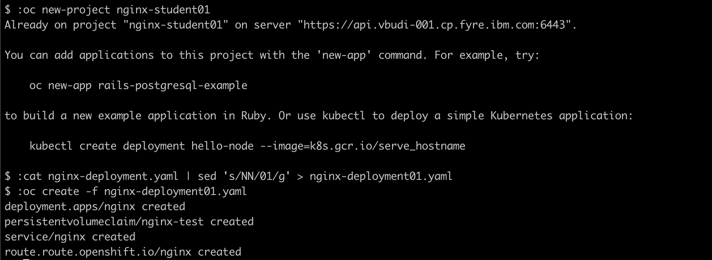
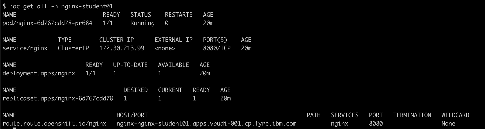
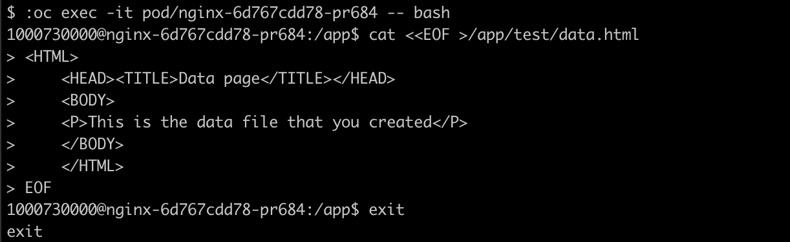

# Deploy sample application

The sample application is a simple nginx Web server. The application structure is shown here:


1. The source YAML definition for the sample application has been downloaded from GIT. You must make a modification as you are using a shared environment.

2. Edit the file `nginx-deployment.yaml` and modify all `nginx-studentNN` with the corresponding 2 digits qualifier. Save the file as `nginx-deploymentNN.yaml`. 

3. Deploy sample app, using the CLI:

    ```
    oc new-project nginx-studentNN

    oc create -f nginx-deploymentNN.yaml
    ```

    The following screenshot shows the steps for bash shell: <br/> 

2. Check the deployed application resources

    ```
    oc get all -n nginx-studentNN
    ```

    

3. Check application using a Web browser, use the route hostname field in a Web browser

    

4. Try to access the path test/data.html from the nginx application - it will return 404 status (not found) 

    

5. Add the following content in the path /app/test/data.html 

    ```
    <HTML>
    <HEAD><TITLE>Data page</TITLE></HEAD>
    <BODY>
    <P>This is the data file that you created</P>
    </BODY>
    </HTML>
    ```

    Run the following commands:

    ```
    oc get pod -n nginx-studentNN
    oc exec -it <podname> -- bash
    cat <<EOF > /app/test/data.html
     . . .
    exit
    ```

    

6. Now try again to access the file. You will now see the new file content. 

    

