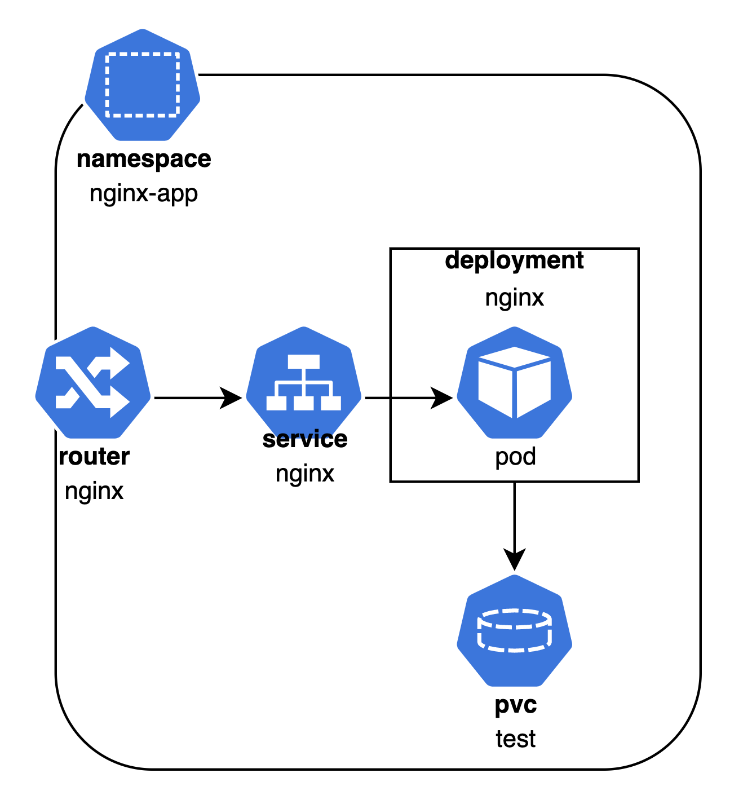

# Deploy sample application

The sample application is a simple nginx Web server. The application structure is shown here:


1. Deploy sample app, using the CLI:

oc create -f nginx-deployment.yaml

2. Check the deployed application resources

oc get all -n nginx-app

3. Check application using a Web browser

4. Try to access the path test/data.html from the nginx application - it will return 404 status (not found) 

5. Add the following content in the path /app/test/data.html 

    ```
    <HTML>
    <HEAD><TITLE>Data page</TITLE></HEAD>
    <BODY>
    <P>This is the data file that you created</P>
    </BODY>
    </HTML>
    ```

6. Now try again to access the file.

