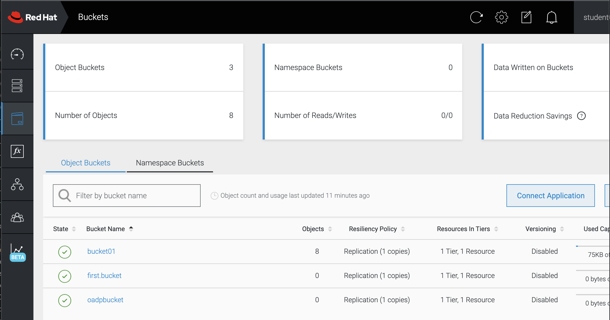

# Backup namespace and storage

Now that you have a working application, lets setup the backup environment:

1. Create a noobaa object bucket claim for your backup target:

    ```
    oc create -f - <<EOF
    apiVersion: objectbucket.io/v1alpha1
    kind: ObjectBucketClaim
    metadata:
      name: bucketNN
      namespace: openshift-adp
    spec:
      bucketName: bucketNN
      storageClassName: openshift-storage.noobaa.io
    EOF
    ```
    **Note** here we hardcode the bucket name, which is not a recommended way as name clashes may happen

2. Create a backup storage location in velero to use the noobaa bucket you created before:

    ```
    oc create -f - <<EOF
    apiVersion: velero.io/v1
    kind: BackupStorageLocation
    metadata:
      name: backuplocationNN
      namespace: openshift-adp
    spec:
        accessMode: ReadWrite
        config:
            insecureSkipTLSVerify: 'true'
            region: noobaa
            s3ForcePathStyle: 'true'
            s3Url: 'https://s3-openshift-storage.apps.CLUSTERNAME.cp.fyre.ibm.com'
        credential:
            key: cloud
            name: cloud-credentials
        default: true
        objectStorage:
            bucket: bucketNN
            prefix: velero
        provider: aws
    EOF
    ```

3. Check your backup environment:

    ```
    velero backup-location get backuplocationNN -n openshift-adp
    velero backup get -n openshift-adp
    ```
    

3. Backup the application namespace PVC to be restored later
 
    ```
    velero backup create studentNN-nginx-backup --include-namespaces nginx-studentNN --storage-location backuplocationNN -n openshift-adp
    velero backup describe studentNN-nginx-backup -n openshift-adp --insecure-skip-tls-verify
    ```
    

4. Verify the backup result - 

    - Go to the noobaa ui at https://noobaa-mgmt-openshift-storage.apps.CLUSTERNAME.cp.fyre.ibm.com/
    - Login with your OpenShift credential (it has been given access)
    - Click *Allow selected permissions*
    - Select **Bucket > bucketNN > Objects** (tab) check what the backup result are. 

    

        what directory structure is created? _________________________________________________


