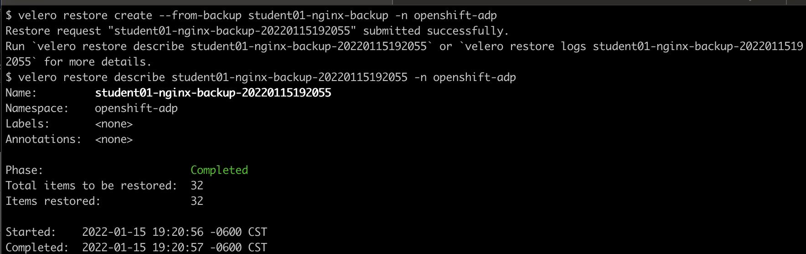

# Restore 

Now that you have a backup created, you will test the restore functionality. 

1. Delete the namespace that hosted your sample application:

    ```
    oc delete project nginx-studentNN
    ```

2. Verify that the objects are deleted

    ```
    oc get all -n nginx-studentNN
    ```

3. Initiate velero restore:

    ```
    velero restore create --from-backup studentNN-nginx-backup -n openshift-adp
    velero restore describe studentNN-nginx-backup-XXXXXXXX -n openshift-adp --insecure-skip-tls-verify
    ```
    
    
4. Check that the objects are restored:

    ```
    oc get all -n nginx-studentNN
    ```

5. Check using a Web browser to both the main page and the test/data.html that you created. Both should be successful.