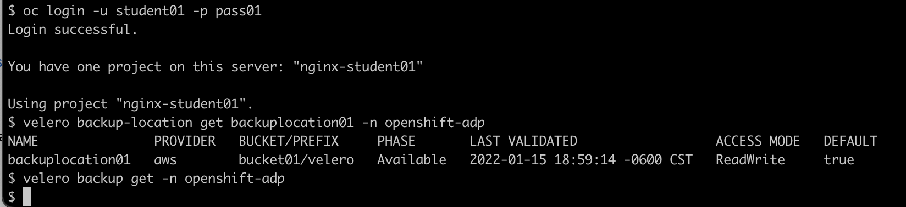
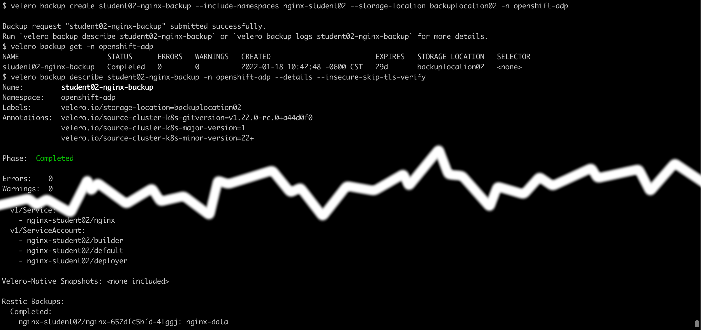

# OpenShift API for Data Protection 

This repository contains the steps needed to demonstrate backup and restore using Velero on an OpenShift cluster.

## Prerequisites:

- OpenShift cluster 
- OpenShift Data Foundation 
- OpenShift API for Data Protection

## Overview

The following information are needed:

- Cluster name: `csm-001`
- Student qualifier: `NN`
- OpenShift Console URL: `https://console-openshift-console.apps.${clustername}.cp.fyre.ibm.com`
- OpenShift API URL: `https://api.${clustername}.cp.fyre.ibm.com:6443`
- OpenShift user: `studentNN`
- OpenShift password: `passNN`

The lab flow is as follows:

1. Launch OpenShift console and check CLIs - [login](#login-to-openshift) 

2. Deploy a sample application with Physical volume on its own namespace. Perform modification on disk. - [sample app](#deploy-sample-application)

3. Run backup. - [backup](#backup-application-and-storage)

4. Restore and verify - [restore](#restore-application)

## Login to OpenShift

Here, you login to the OpenShift Web console and prepare the CLI access to perform the lab. Perform the following actions:

1. Open a Web Browser to the OpenShift console URL. Accept the certificate errors for both `console-openshift-console` and `oauth-openshift` URLs. You will arrive in the OpenShift login screen: <br/> 

2. Enter the user and password for OpenShift, the user should be in the format of `studentNN` and the password is `passNN` where NN is your 2 digits qualifier (01-35).

3. From the console, you are in the Developer view. click **Skip tour**.<br/><br/>At this stage, you are ready for the Web interface, some activities will be performed on this OpenShift Web Console, while others must use a Comand line interface because the user is not a cluster administrator.

4. Start your CLI session and verify all the other required CLIs from your system, if the command does not exist, then you must install them for this lab:

    - `oc`: see [https://docs.openshift.com/container-platform/4.7/cli_reference/openshift_cli/getting-started-cli.html](https://docs.openshift.com/container-platform/4.7/cli_reference/openshift_cli/getting-started-cli.html)
    - `velero`: see [https://github.com/vmware-tanzu/velero/releases](https://github.com/vmware-tanzu/velero/releases)

5. Login to OpenShift using the `oc` command line interface, use the command:

    ```
    oc login -u studentNN -p passNN <api-endpoint>
    ```

    

    Now your Command Line interface is ready; keep the CLI window open and you can use them whenever you need to run a command to interact with the system.

## Deploy Sample Application

The sample application is a simple single pod deployment running nginx Web server; which have a PVC mounted under `/app/test` with a router frontend. The application structure is shown here:


The instructions for deploying and modifying this application is as follows:

1. From the Web console - click the link `Create a new Project` and specify `nginx-studentNN` as the project name and click **Create**. <br/>

2. Click the  button on the upper right corner of the page and paste the YAML definition from [https://github.com/vbudi000/oadp/blob/main/nginx-deployment.yaml](https://github.com/vbudi000/oadp/blob/main/nginx-deployment.yaml). Replace all occurences of `NN` to your assigned student number, click **Create**. <br/>


2. Check the deployed application resources using the Topology view, click **Topology** on the left navigation menu and click on the big circle there.

    

3. Click on the Route object location option to open the application in a new tab:

    

4. Try to access the path test/data.html from the nginx application - it will return 404 status (not found) 

    

5. Right click on the pod object and open it in a new browser tab and click on the **Terminal** tab. In the terminal session, add the following content in the path `/app/test/data.html`. 

    ```
    <HTML>
    <HEAD><TITLE>Data page</TITLE></HEAD>
    <BODY>
    <P>This is the data file that you created</P>
    </BODY>
    </HTML>
    ```

    An example of creating this file is shown below:

    

6. Now try again to access the file. You will now see the new file content. 

    

## Backup Application and Storage

Now that you have a working application, lets setup the backup environment:

1. Create a noobaa Object Bucket Claim for your backup target, an ObjectBucketClaim is a claim to acquire or build an ObjectBucket just like a PVC to a PV. You can use the  button and paste the following content (remember to replace all the `NN` to your student qualifier):

    ```
    apiVersion: objectbucket.io/v1alpha1
    kind: ObjectBucketClaim
    metadata:
      name: bucketNN
      namespace: openshift-adp
    spec:
      bucketName: bucketNN
      storageClassName: openshift-storage.noobaa.io
    ```

    **Note** Wait until the status of the Object Bucket Claim is `Bound` before proceeding.

2. Create a Backup Storage Location in velero to use the noobaa bucket you created before, a BackupStorageLocation defines a backup target for velero to store the backup. You can use the  button and paste the following content (remember to replace all the `NN` to your student qualifier and the `CLUSTERNAME` to the actual cluster name):

    ```
    apiVersion: velero.io/v1
    kind: BackupStorageLocation
    metadata:
      name: backuplocationNN
      namespace: openshift-adp
    spec:
        accessMode: ReadWrite
        config:
            insecureSkipTLSVerify: 'true'
            region: noobaa
            s3ForcePathStyle: 'true'
            s3Url: 'https://s3-openshift-storage.apps.<CLUSTERNAME>.cp.fyre.ibm.com'
        credential:
            key: cloud
            name: cloud-credentials
        default: true
        objectStorage:
            bucket: bucketNN
            prefix: velero
        provider: aws
    ```

3. Use the CLI environment to check your velero resources; note that all velero resources are in `openshift-adp` namespace:

    ```
    velero backup-location get backuplocationNN -n openshift-adp
    velero backup get -n openshift-adp
    ```
    

3. Backup the application namespace PVC to be restored later
 
    ```
    velero backup create studentNN-nginx-backup --include-namespaces nginx-studentNN --storage-location backuplocationNN -n openshift-adp
    velero backup describe studentNN-nginx-backup -n openshift-adp --details --insecure-skip-tls-verify
    ```
    

    Make sure that you have the Restic backup completed as shown at the bottom of the output.

4. Verify the backup result:

    - Go to the noobaa ui at `https://noobaa-mgmt-openshift-storage.apps.<CLUSTERNAME>.cp.fyre.ibm.com/`    
    - Login with your OpenShift credential (it has been given access)
    - Click *Allow selected permissions*
    - Select **Bucket > bucketNN > Objects** (tab) check what the backup result are. 

    

    what directory structures are created? 
    - _________________________________________________
    - _________________________________________________


## Restore Application

Now that you have a backup created, you will test the restore functionality. 

1. Delete the project that hosted your sample application, from the OpenShift Web Console, select the **Project** navigation menu, and select **Actions** > **Delete Project** and confirm by entering the project name `nginx-studentNN`. <br/> 


2. The project screen will be empty. <br/>


    
