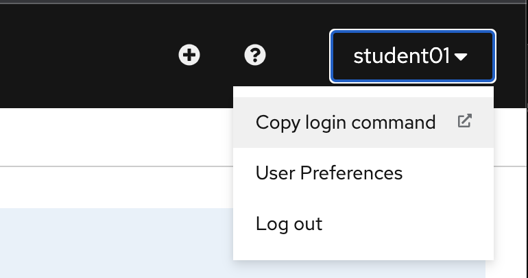
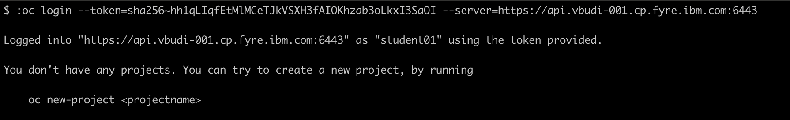
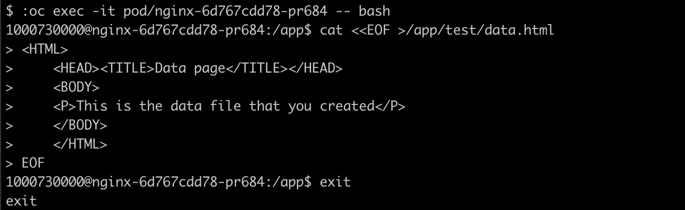
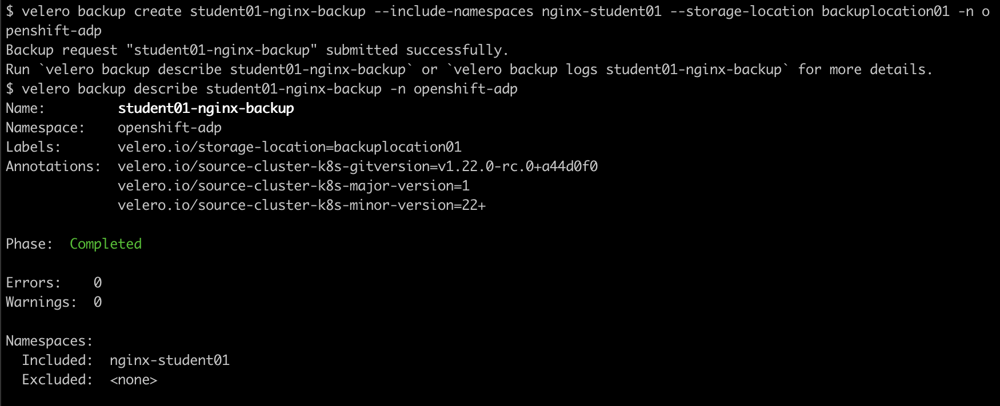
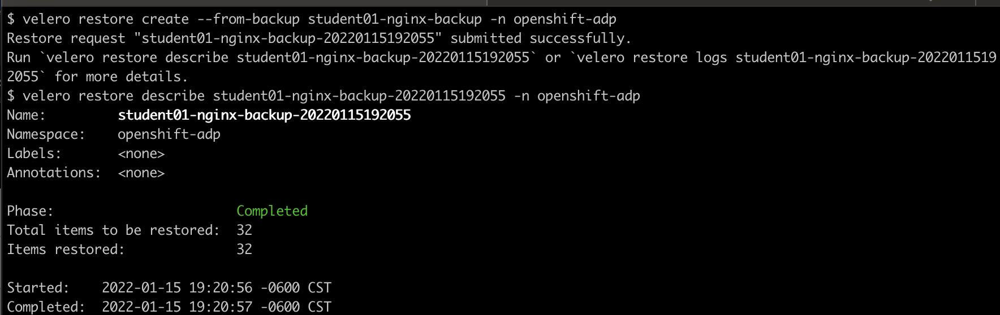

# OpenShift API for Data Protection 

This repository contains the steps needed to demonstrate backup and restore using Velero on an OpenShift cluster.

## Prerequisites:

- OpenShift Data Foundation 
- OpenShift API for Data Protection

## Overview

The following information are needed:

- OpenShift Console URL: `https://console-openshift-console.apps.vbudi-001.cp.fyre.ibm.com`
- OpenShift API URL: `https://api.vbudi-001.cp.fyre.ibm.com:6443`
- OpenShift user: `studentNN`
- OpenShift password: `passNN`

The lab flow is as follows:

1. Launch OpenShift console and check CLIs - [01-login.md](01-login.md) 

2. Deploy a sample application with Physical volume on its own namespace. Perform modification on disk. - [02-sampleapp.md](02-sampleapp.md)

3. Run backup. - [03-backup.md](03-backup.md)

4. Restore and verify - [04-restore.md](04-restore.md)

## Login to OpenShift Web console

Perform the following actions:

1. Open a Web Browser to the OpenShift console URL. Accept the certificate errors for both `console-openshift-console` and `oauth-openshift` URLs. You will arrive in the OpenShift login screen: <br/> 

2. Enter the user and password for OpenShift, the user should be in the format of `studentNN` and the password is `passNN` where NN is your 2 digits qualifier (01-35).

3. From the console, you are in the Developer view. click **Skip tour**.<br/> 

4. Verify all the other required CLIs from your system:

    - oc: see [https://docs.openshift.com/container-platform/4.7/cli_reference/openshift_cli/getting-started-cli.html](https://docs.openshift.com/container-platform/4.7/cli_reference/openshift_cli/getting-started-cli.html)
    - velero: see [https://github.com/vmware-tanzu/velero/releases](https://github.com/vmware-tanzu/velero/releases)

5. From your login drop down on the top right corner select **Copy Login Command**. <br/>

6. In the new tab, click `Display Token` and copy the `oc login` command with the token. <br/> 

7. Open a command line window and paste the login command. 
<br/>

Now you have validated the environment.

## Deploy sample application

The sample application is a simple nginx Web server. The application structure is shown here:


1. From the Web console - click the New Project button and create nginx-studentNN project. 

2. Click the **+** button on the upper right corner of the page and paste the YAML definition from [https://github.com/vbudi000/oadp/blob/main/nginx-deployment.yaml](https://github.com/vbudi000/oadp/blob/main/nginx-deployment.yaml). Replace all occurences of `NN` to your assigned student number.

2. Check the deployed application resources using the Topology view 

    ```
    oc get all -n nginx-studentNN
    ```

    

3. Get the route object and open the Web page 

    

4. Try to access the path test/data.html from the nginx application - it will return 404 status (not found) 

    

5. Add the following content in the path /app/test/data.html 

    ```
    <HTML>
    <HEAD><TITLE>Data page</TITLE></HEAD>
    <BODY>
    <P>This is the data file that you created</P>
    </BODY>
    </HTML>
    ```

    Run the following commands:

    ```
    oc get pod -n nginx-studentNN
    oc exec -it <podname> -- bash
    cat <<EOF > /app/test/data.html
     . . .
    exit
    ```

    

6. Now try again to access the file. You will now see the new file content. 

    

## Backup namespace and storage

Now that you have a working application, lets setup the backup environment:

1. Create a noobaa object bucket claim for your backup target:

    ```
    oc create -f - <<EOF
    apiVersion: objectbucket.io/v1alpha1
    kind: ObjectBucketClaim
    metadata:
      name: bucketNN
      namespace: openshift-adp
    spec:
      bucketName: bucketNN
      storageClassName: openshift-storage.noobaa.io
    EOF
    ```
    **Note** here we hardcode the bucket name, which is not a recommended way as name clashes may happen

2. Create a backup storage location in velero to use the noobaa bucket you created before:

    ```
    oc create -f - <<EOF
    apiVersion: velero.io/v1
    kind: BackupStorageLocation
    metadata:
      name: backuplocationNN
      namespace: openshift-adp
    spec:
        accessMode: ReadWrite
        config:
            insecureSkipTLSVerify: 'true'
            region: noobaa
            s3ForcePathStyle: 'true'
            s3Url: 'https://s3-openshift-storage.apps.CLUSTERNAME.cp.fyre.ibm.com'
        credential:
            key: cloud
            name: cloud-credentials
        default: true
        objectStorage:
            bucket: bucketNN
            prefix: velero
        provider: aws
    EOF
    ```

3. Check your backup environment:

    ```
    velero backup-location get backuplocationNN -n openshift-adp
    velero backup get -n openshift-adp
    ```
    

3. Backup the application namespace PVC to be restored later
 
    ```
    velero backup create studentNN-nginx-backup --include-namespaces nginx-studentNN --storage-location backuplocationNN -n openshift-adp
    velero backup describe studentNN-nginx-backup -n openshift-adp --insecure-skip-tls-verify
    ```
    

4. Verify the backup result - 

    - Go to the noobaa ui at https://noobaa-mgmt-openshift-storage.apps.CLUSTERNAME.cp.fyre.ibm.com/
    - Login with your OpenShift credential (it has been given access)
    - Click *Allow selected permissions*
    - Select **Bucket > bucketNN > Objects** (tab) check what the backup result are. 

    

        what directory structure is created? _________________________________________________


## Restore 

Now that you have a backup created, you will test the restore functionality. 

1. Delete the namespace that hosted your sample application:

    ```
    oc delete project nginx-studentNN
    ```

2. Verify that the objects are deleted

    ```
    oc get all -n nginx-studentNN
    ```

3. Initiate velero restore:

    ```
    velero restore create --from-backup studentNN-nginx-backup -n openshift-adp
    velero restore describe studentNN-nginx-backup-XXXXXXXX -n openshift-adp --insecure-skip-tls-verify
    ```
    
    
4. Check that the objects are restored:

    ```
    oc get all -n nginx-studentNN
    ```

5. Check using a Web browser to both the main page and the test/data.html that you created. Both should be successful.